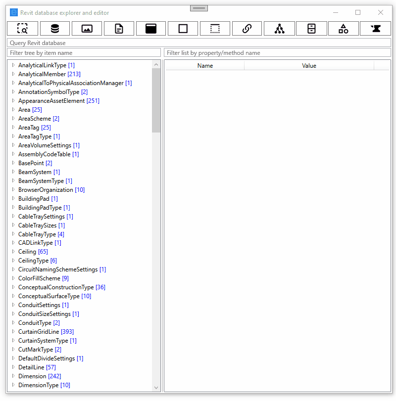
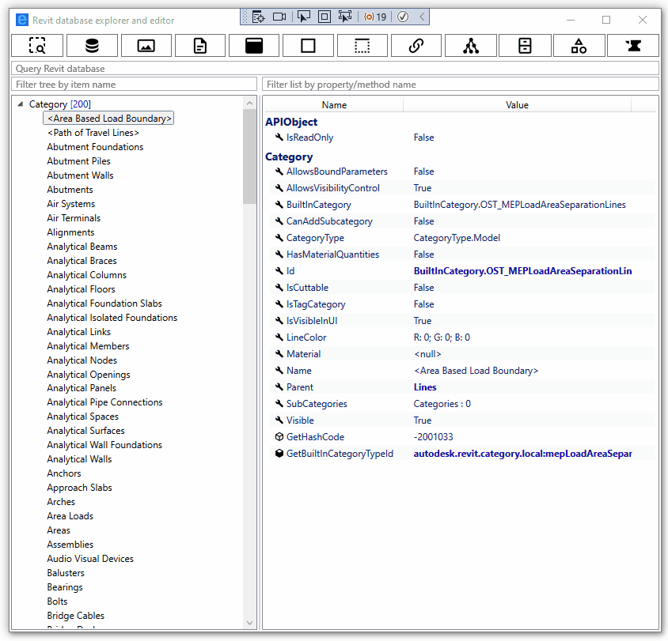
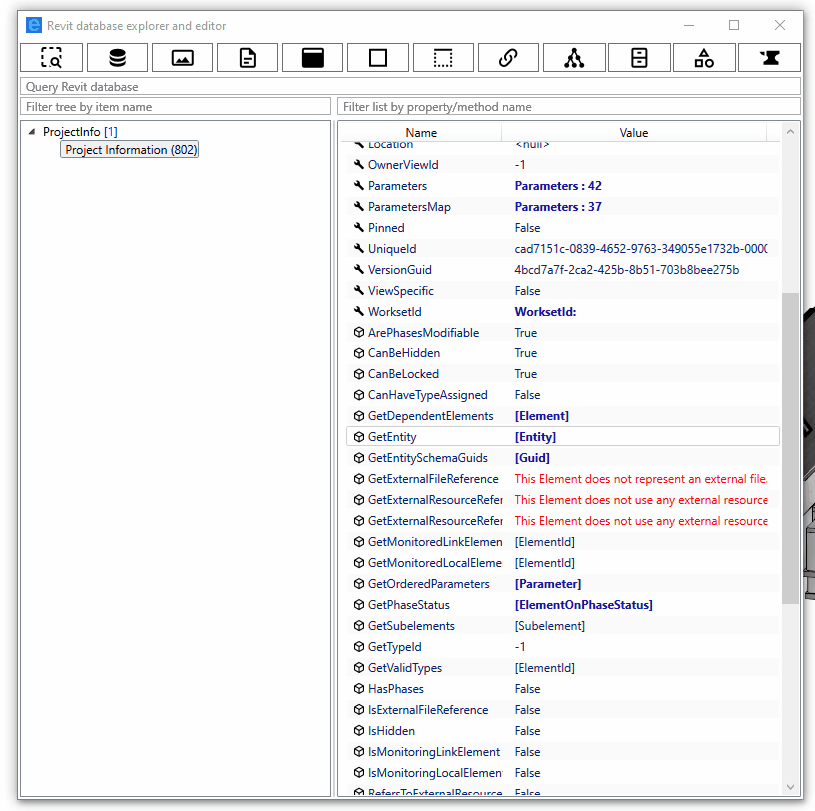
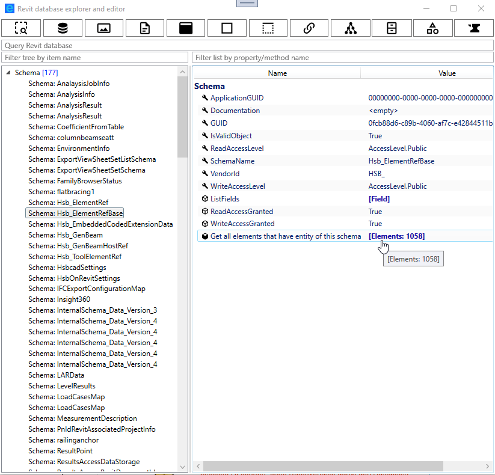

# Revit database explorer (RDBE)

Yet another [RevitLookup](https://github.com/jeremytammik/RevitLookup) clone. RevitLookup is a mature and indispensable tool to work with Revit. But its code had many authors and architectural changes(reflection, modeless) through time which led to quite significant technical debt and lack of consistency. For worse, its UI is still based on WinForms ... When I was adding support for [modeless windows #93](https://github.com/jeremytammik/RevitLookup/pull/93) to RevitLookup , I knew that at some point in time I will rewrite it whole. So here we are, let me introduce you to RDBE, a completely rewritten RevitLookup with WPF UI and a few small improvements:

- [possibility to query Revit database from UI](#possibility-to-query-Revit-database-from-UI)
- [filterable list of properties and metohds](#filterable-list-of-properties-and-metohds)
- [filterable tree of elements](#filterable-tree-of-elements)
- [elements of Family, FamilySymbol, FamilyInstance are grouped by category in tree](#grouping)
- [tooltips with Revit documentation](#tooltips-with-Revit-documentation)
- [extensive support for ForgeTypeId](#extensive-support-for-ForgeTypeId)
- [snooping all Forge types](#snooping-all-Forge-types)
- [snooping all categories that may be used in a ParameterFilterElement](#snooping-all-categories-that-may-be-used-in-a-ParameterFilterElement)
- [snooping Extensible Storage framework schemas](#snooping-Extensible-Storage-framework-schemas)
- [more natural access to Extensible Storage entities](#more-natural-access-to-Extensible-Storage-entities)
- [finding every element that has an entity of a given schema](#finding-every-element-that-has-an-entity-of-a-given-schema)
- [easier access to Element.Geometry](#geometry)
- [more data exposed from Rebar](#more-data-exposed-from-rebar)

## Installation

- MSI instalator you will find in [Releases section](https://github.com/NeVeSpl/RevitDBExplorer/releases/latest) atached as an asset.

## Features

### possibility to query Revit database from UI

It is a very early version of this feature, but it can interpret words separated by `,` as element ids, Revit classes, and categories. It builds from them FilteredElementCollector (which syntax is available in a tooltip) and use it to query Revit database. The table with all available options/grammar is below the example.

 
keywords/text | Interpretation | translates to in Revit Api
----------|------------| ----
`,`, `;` | seperates phrases/commands
`:` | reserved, not used right now
`active`, `active view` | select elements from active view | FilteredElementCollector(doc, doc.ActiveView.Id)
`type`, `element type`  | select only types | .WhereElementIsElementType()
`element`, `not element type` | select only elements | .WhereElementIsNotElementType()
e.g. `123456` - number | select elements with given ids  | var ids = new [] {new ElementId(123456)}  FilteredElementCollector(document, ids)
e.g. `Wall` - revit class | select elements of given class | .OfClass(typeof(Wall))
e.g. `OST_Windows` - revit category | select elements of given category | .OfCategory(BuiltInCategory.OST_Windows)
`foo` - any not recognized text | serach for given text in parameters : Name, Mark |BuiltInParameter.ALL_MODEL_TYPE_NAME, BuiltInParameter.ALL_MODEL_MARK, BuiltInParameter.ELEM_FAMILY_AND_TYPE_PARAM

Queries are case-insensitive, you can query for many ids, but only for one category/class at a time. Matching for categories/classes is done in a fuzzy way, you do not have to be very precise with names, but this may lead to some false positive results.

### filterable list of properties and metohds 

### filterable tree of elements

### elements of Family, FamilySymbol, FamilyInstance are grouped by category in the tree

### tooltips with Revit documentation

They are problems with loading some of tooltips, but most of them should work.

### extensive support for ForgeTypeId

We all love (or hate) ForgeTypeId, RDBE exposes all data related to a given id scattered through many utils.

### snooping all Forge types

### snooping all categories that may be used in a ParameterFilterElement

### snooping Extensible Storage framework schemas

### more natural access to Extensible Storage entities

You get access to Extensible Storage data exactly like through Api, by invoking: Element.GetEntity(). In contrast to Revit Lookup, you will only see entities that you can read and really exist in a given element. (Revit Lookup shows an exception when cannot access entity even when an entity does not exist in a given element....)

### finding every element that has an entity of a given schema

### easier access to Element.Geometry

### more data exposed from Rebar

- DoesBarExistAtPosition, 
- GetCenterlineCurves, 
- GetCouplerId, 
- GetEndTreatmentTypeId, 
- GetFullGeometryForView,
- GetHookOrientation,
- GetHookRotationAngle, 
- GetHookTypeId,
- GetMovedBarTransform,
- GetTransformedCenterlineCurves,
- IsBarHidden.

## Supported Revit versions

Only Revit 2023 is supported.
