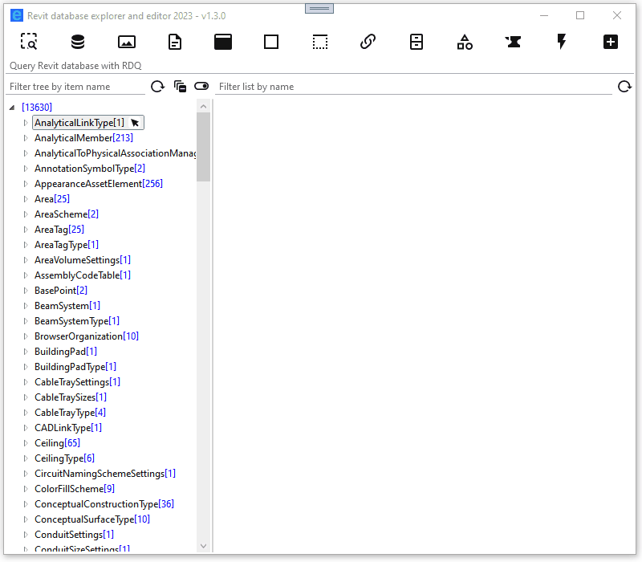
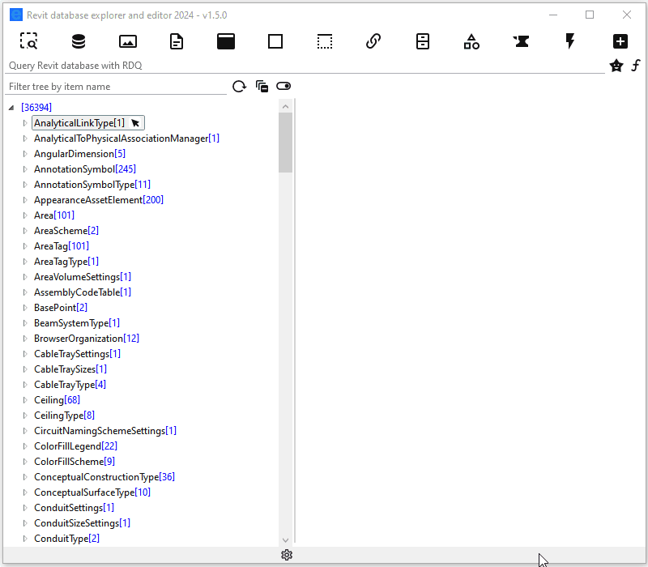
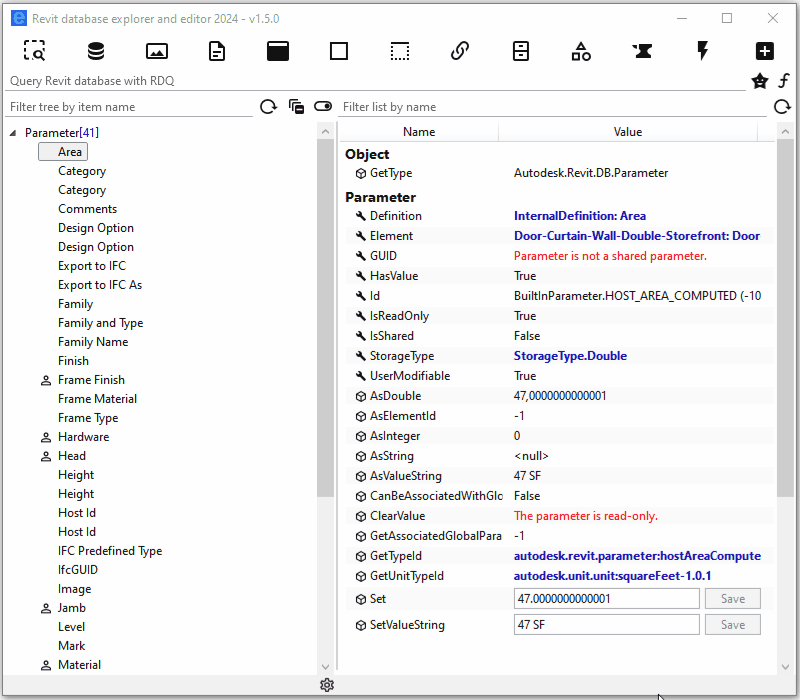
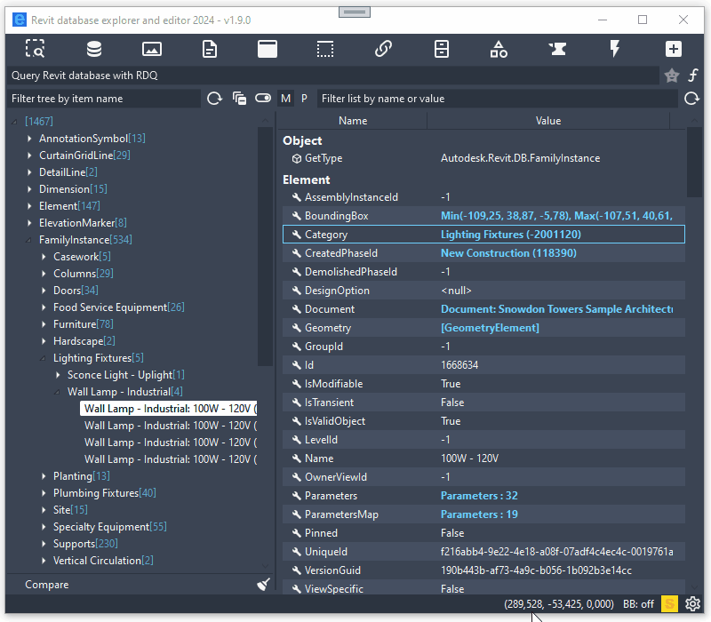
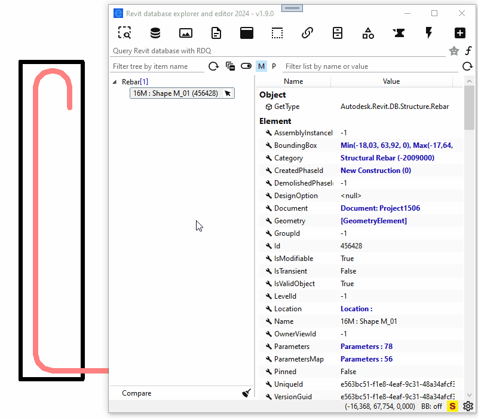
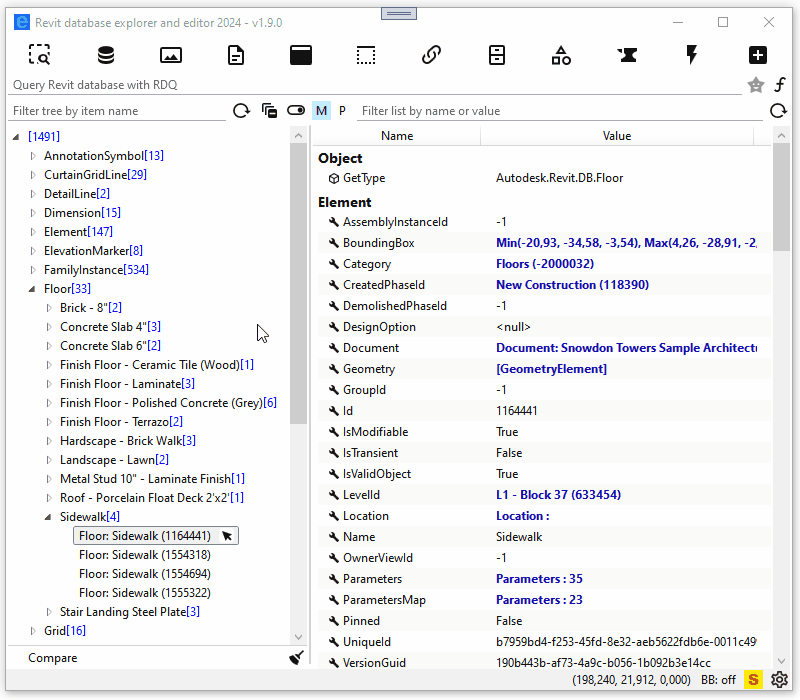
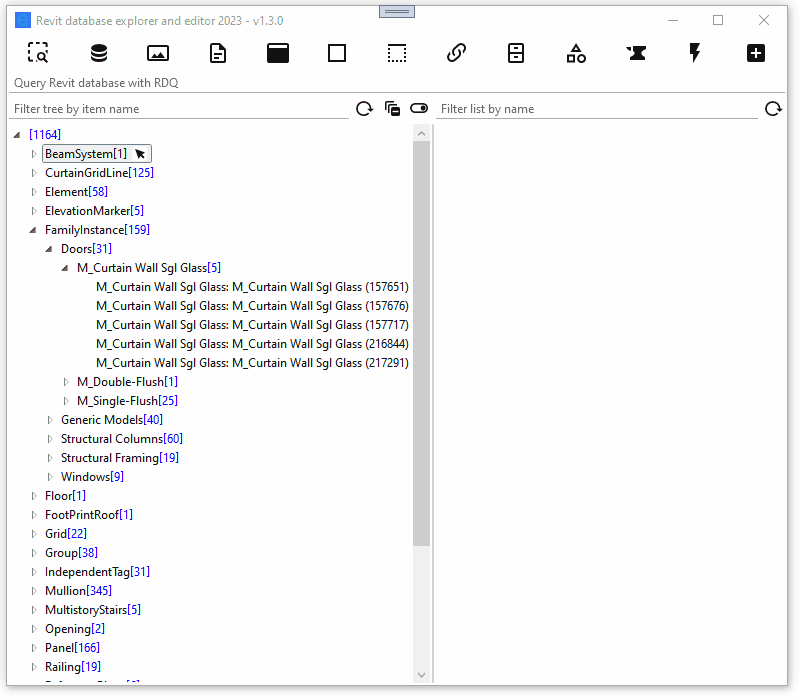

# Revit database explorer (RDBE)

**The fastest, modern, asynchronous Revit database exploration tool for Revit 2021+.**

Yet another [RevitLookup](https://github.com/jeremytammik/RevitLookup) clone. RevitLookup is mature and was an indispensable tool to work with Revit API for many years. But now, there is a better tool for the job. Let me introduce you to RDBE and its capabilities. RDBE not only allows us to explore in a more efficient way thanks to querying, but also to modify Revit database through ad hoc scripts written in C#. 

- [query Revit database](#query-revit-database-with-rdq-revit-database-querying)
- [script Revit database](#script-revit-database-with-rds-revit-database-scripting)
  - [ad hoc SELECT query](#ad-hoc-select-query)
  - [ad hoc UPDATE command](#ad-hoc-update-command)
- [filterable tree of elements and list of properties and methods](#filterable-tree-of-elements-and-list-of-properties-and-methods)
- [easy access to Revit API documentation](#easy-access-to-revit-api-documentation)
- [edit parameter value](#edit-parameter-value)
- [extensive support for ForgeTypeId](#extensive-support-for-forgetypeid)
- [better support for Revit Extensible Storage](#better-support-for-revit-extensible-storage)
- [easier work with Element.Geometry](#easier-work-with-elementgeometry)
- [dark and light UI themes](#dark-and-light-ui-themes)
- [more advanced tree view](#more-advanced-tree-view)
- [snoop Revit events](#snoop-revit-events-with-rem-revit-event-monitor)
- [snoop updaters](#snoop-updaters)
- [more data exposed](#more-data-exposed-from-revit-database)

## Installation

Download and install [RevitDBExplorer.msi](https://github.com/NeVeSpl/RevitDBExplorer/releases/latest/download/RevitDBExplorer.msi). Setup will install RDBE for Revit 2021, 2022, 2023, 2024.

## YouTube tutorials

[How to select elements that pass Rule-based Filter defined in Revit?](https://www.youtube.com/watch?v=9Uup4Qe8csI)
[How to find an element using its IfcGuid in Revit?](https://www.youtube.com/watch?v=oT6bxfKc2lg)

## Features

### query Revit database with RDQ (Revit database querying)

RDQ is able to interpret words separated by `,` as element ids, Revit classes, categories, parameters and many more. RDQ builds from them FilteredElementCollector and uses it to query Revit database. [Learn more about RQL (Revit query language) used by RDQ.](documentation/revit-database-querying.md#revit-database-querying)

### script Revit database with RDS (Revit database scripting)

RDS is intended to run C# code that is too small or ephemeral to make macro/dynamo/addon for it. RDS scripts are divided into two categories : 
- SELECT query, where result of the query is dispayed in the RDBE UI 
- UPDATE command, where as a result of the command execution, the model is changed

category | SELECT query | UPDATE command
---|--------------|---------------
returns | something   | `void`
can change model | **no**, it is read-only | **yes**, it runs inside transaction

RDS aims to facilitate writing scripts by code generation in some areas: 
- it can generate a SELECT query from any RDQ query
- it can generate an UPDATE command for any parameter 

Input parameters are available for both types of scripts. Besides a few predefined variables, any object (or group of objects) displayed in the Tree, can be used as input for the script.

#### ad hoc SELECT query

#### ad hoc UPDATE command

An example shows how to add prefix to `Mark` parameter for many selected elements as inputs for the script. 

### filterable tree of elements and list of properties and methods

### easy access to Revit API documentation

 Tooltips work out-of-box, RevitApi.chm file is part of [Revit SDK](https://www.autodesk.com/developer-network/platform-technologies/revit) and path to it needs to be set manually.

### edit parameter value

### extensive support for ForgeTypeId

We all love (or hate) the ForgeTypeId, RDBE exposes all data related to a given ForgeTypeId scattered through many utils. You can also snoop all ForgeTypeIds returned from: 
- ParameterUtils.GetAllBuiltInGroups
- ParameterUtils.GetAllBuiltInParameters
- UnitUtils.GetAllMeasurableSpecs
- UnitUtils.GetAllDisciplines
- SpecUtils.GetAllSpecs
- UnitUtils.GetAllUnits

### better support for Revit Extensible Storage

RDBE allows you to snoop all schemas that are loaded into Revit memory, and you can easily get all elements that have an entity of a given schema. You get access to Extensible Storage data exactly like through RevitApi, by invoking: Element.GetEntity(). In contrast to Revit Lookup, you will only see entities that you can read and really exist in a given element. (Revit Lookup shows an exception when cannot access an entity even when an entity does not exist in a given element....)

### easier work with Element.Geometry

Not only you have faster access to a geometry of an element, but you can also select an instance of GeometryObject in Revit if it has a valid reference.  

### dark and light UI themes

### more advanced tree view

With grouping on many levels, and possibility to switch between grouping by Type or Category on the first level.

### snoop Revit events with REM (Revit Event Monitor)

A new take on [EventsMonitor from  RevitSdkSamples
](https://github.com/jeremytammik/RevitSdkSamples/tree/master/SDK/Samples/Events/EventsMonitor/CS). RDBE stores the latest 30 events that occurred during Revit session and allows to snoop them. UIControlledApplication.Idling event and ControlledApplication.ProgressChanged event are not stored because they are too noisy - they happen too often. In order to use this feature, you need to enable event monitor, which by default is disabled.

### snoop updaters

RDBE allows to look deeper into UpdaterRegistry.GetRegisteredUpdaterInfos(). What is special about this feature is that, with a bit of luck, it is able to get UpdaterId, as a first publicly available tool.

### more data exposed from Revit database

In comparison to RevitLookup, RDBE in addition gives access to:

- BasicFileInfo
    - Extract
- Category
    - IsBuiltInCategory
    - GetBuiltInCategory
    - GetBuiltInCategoryTypeId
- Curve
    - GetEndParameter
- Document
    - GetTypeOfStorage
    - GetChangedElements
    - GetDefaultElementTypeId
    - GetDocumentVersion
    - GetWorksetId
    - EditFamily
- Element
    - **GetMaterialIds**
    - GetMaterialArea
    - GetMaterialVolume    
- FormatOptions
    - GetValidSymbols
    - CanHaveSymbol
- **HostObject**
    - **FindInserts**
- **HostObjectUtils**
    - **GetTopFaces**
    - **GetBottomFaces**
    - **GetSideFaces**
- **JoinGeometryUtils**
    - **GetJoinedElements**
    - **IsCuttingElementInJoin** 
- LabelUtils
    - GetLabelForBuiltInParameter
    - GetLabelForGroup
    - GetLabelForUnit
    - GetLabelForSpec
    - GetLabelForSymbol
    - GetLabelForDiscipline
- ParameterUtils
    - IsBuiltInParameter
    - GetBuiltInParameter
    - IsBuiltInGroup
    - GetBuiltInParameterGroup
- Rebar
    - DoesBarExistAtPosition 
    - **GetCenterlineCurves** 
    - GetCouplerId 
    - GetEndTreatmentTypeId 
    - **GetFullGeometryForView**
    - GetHookOrientation
    - GetHookRotationAngle
    - GetHookTypeId
    - **GetMovedBarTransform**
    - **GetOverridableHookParameters**
    - **GetTransformedCenterlineCurves**
    - IsBarHidden
- RebarBarType
    - GetAutoCalcHookLengths,
    - GetHookLength, 
    - GetHookOffsetLength, 
    - GetHookPermission
    - GetHookTangentLength
- RebarShapeDrivenAccessor
    - **GetBarPositionTransform**
- ScheduleDefinition
    - GetFilter
    - GetSortGroupField
- SpatialFieldManager
    - GetSpatialFieldManager
    - GetResultSchema
- SpecUtils
    - IsValidDataType
    - IsSpec
- StructuralSectionUtils
    - GetStructuralSection
- TableView
    - GetAvailableParameters
- UnitFormatUtils
    - Format
- UnitUtils
    - IsMeasurableSpec
    - IsSymbol
    - IsUnit
    - GetDiscipline
    - GetTypeCatalogStringForSpec
    - GetTypeCatalogStringForUnit
    - GetValidUnits
- Wall
    - IsWallCrossSectionValid
- WorksharingUtils
    - GetCheckoutStatus
    - GetModelUpdatesStatus
    - GetWorksharingTooltipInfo
- View
    - CanViewBeDuplicated
    - **GetElementOverrides**
    - IsInTemporaryViewMode
    - SupportsWorksharingDisplayMode    
- ViewCropRegionShapeManage
    - GetSplitRegionMaximum
    - GetSplitRegionMinimum

