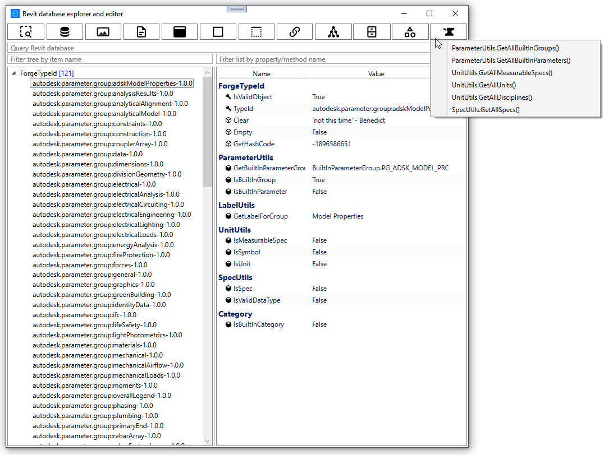
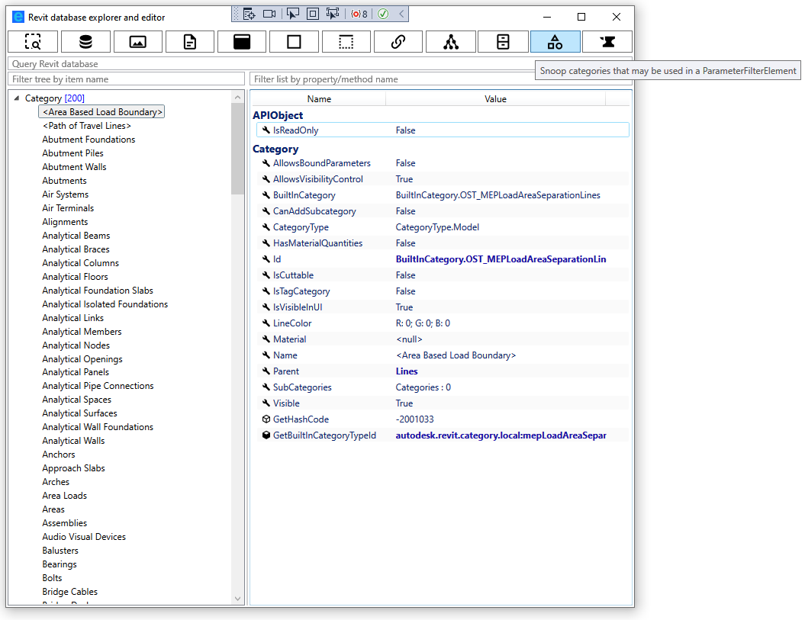
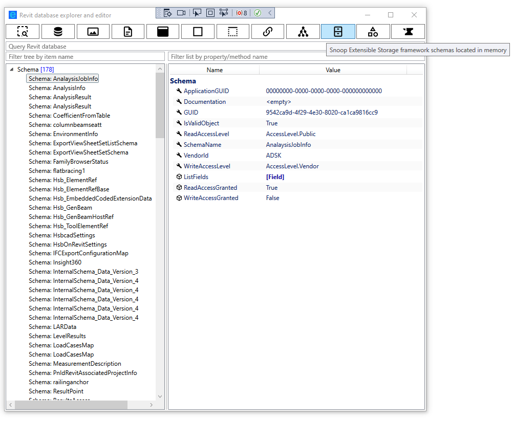

# Revit database explorer (RDBE)

Yet another [RevitLookup](https://github.com/jeremytammik/RevitLookup) clone. RevitLookup is a mature and indispensable tool to work with Revit. But its code had many authors and architectural changes(reflection, modeless) through time which led to quite significant technical debt and lack of consistency. For worse, its UI is still based on WinForms ... When I was adding support for [modeless windows #93](https://github.com/jeremytammik/RevitLookup/pull/93) to it, I knew that at some point in time I will rewrite whole. So here we are, let me introduce you to RDBE, a completely rewritten RevitLookup with WPF UI and a few small improvements:

- [possibility to query Revit database from UI](#possibility-to-query-Revit-database-from-UI)
- [filterable list of properties and metohds](#filterable-list-of-properties-and-metohds)
- [filterable tree of elements](#filterable-tree-of-elements)
- [elements of Family, FamilySymbol, FamilyInstance are grouped by category in tree](#grouping)
- [tooltips with Revit documentation](#tooltips-with-Revit-documentation)
- [extensive support for ForgeTypeId](#extensive-support-for-ForgeTypeId)
- [snooping all Forge types](#snooping-all-Forge-types)
- [snooping all categories that may be used in a ParameterFilterElement](#snooping-all-categories-that-may-be-used-in-a-ParameterFilterElement)
- [snooping Extensible Storage framework schemas](#snooping-Extensible-Storage-framework-schemas)
- [more natural access to Extensible Storage entities](#more-natural-access-to-Extensible-Storage-entities)
- [easier access to Element.Geometry](#easier-access-to-Element.Geometry)
- [more data exposed from Rebar](#more-data-exposed-from-rebar)

### possibility to query Revit database from UI

### filterable list of properties and metohds 

### filterable tree of elements

### elements of Family, FamilySymbol, FamilyInstance are grouped by category in tree

### tooltips with Revit documentation

### extensive support for ForgeTypeId

We all love (or hate) ForgeTypeId, RDBE exposes all data related to a given id scattered through many utils.

### snooping all Forge types

### snooping all categories that may be used in a ParameterFilterElement

### snooping Extensible Storage framework schemas

### more natural access to Extensible Storage entities

### easier access to Element.Geometry

### more data exposed from Rebar

- DoesBarExistAtPosition, 
- GetCenterlineCurves, 
- GetCouplerId, 
- GetEndTreatmentTypeId, 
- GetFullGeometryForView,
- GetHookOrientation,
- GetHookRotationAngle, 
- GetHookTypeId,
- GetMovedBarTransform,
- GetTransformedCenterlineCurves,
- IsBarHidden.

## Supported Revit versions

Only Revit 2023 is supported.