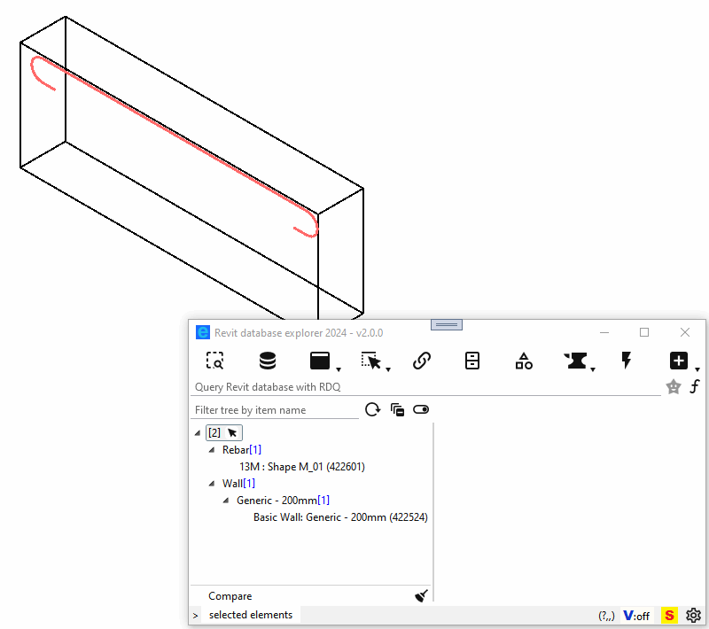
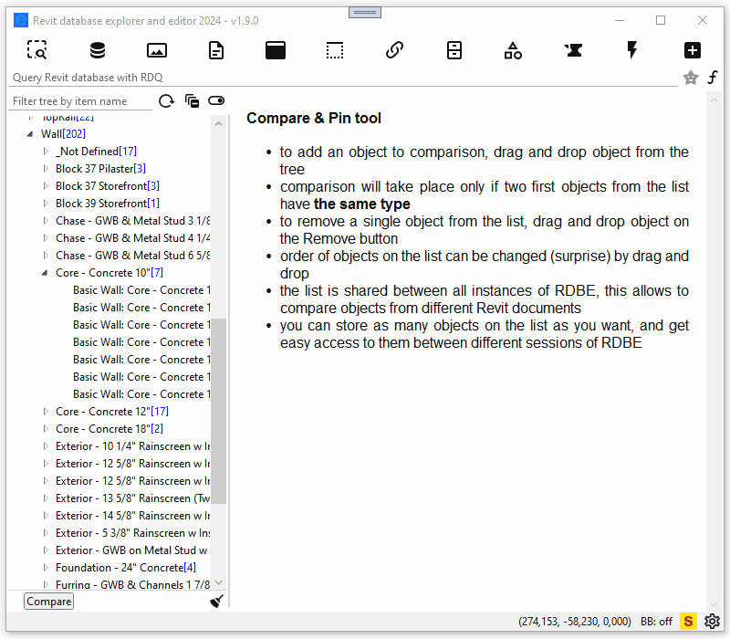
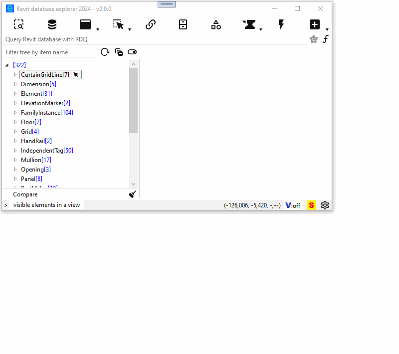
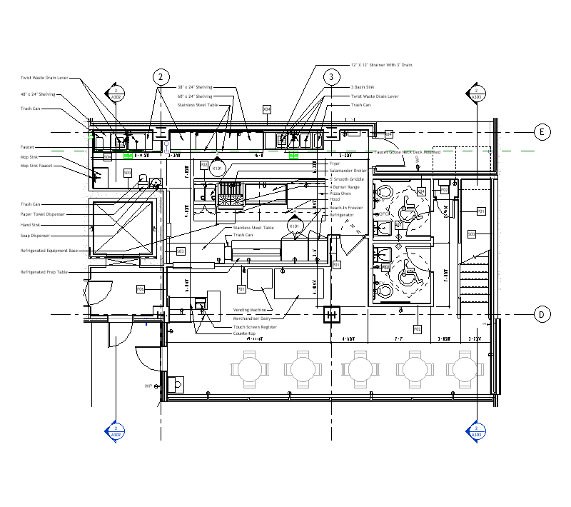

# Revit database explorer

**The fastest, most advanced, asynchronous Revit database exploration tool for Revit 2021+.**

Yet another [RevitLookup](https://github.com/jeremytammik/RevitLookup) like tool. RevitLookup was an indispensable tool to work with Revit API for many years. But now, there is a better tool for the job. Let me introduce you to Revit database explorer. It not only allows us to **explore** database but also to:
- **edit** any parameter value
- **query** database with intuitive syntax that is translated into a FilteredElementCollector
- **script** by running ad hoc scripts written in C#
- **visualize** geometrical features of elements

List of features:

- [easier work with Element.Geometry](#easier-work-with-elementgeometry)
- [compare objects and parameters](#compare-object-members-and-element-parameters-values)
- [query Revit database](#query-revit-database-with-rdq-revit-database-querying)
- [script Revit database](#script-revit-database-with-rds-revit-database-scripting)
  - [ad hoc SELECT query](#ad-hoc-select-query)
  - [ad hoc UPDATE command](#ad-hoc-update-command)
- [easy access to Revit API documentation](#easy-access-to-revit-api-documentation)
- [edit parameter value](#edit-parameter-value)
- [extensive support for ForgeTypeId](#extensive-support-for-forgetypeid)
- [better support for Revit Extensible Storage](#better-support-for-revit-extensible-storage)
- [dark and light UI themes](#dark-and-light-ui-themes)
- [snoop Revit events](#snoop-revit-events-with-rem-revit-event-monitor)

## Installation

Download and install [RevitDBExplorer.msi](https://github.com/NeVeSpl/RevitDBExplorer/releases/latest/download/RevitDBExplorer.msi). Setup will install Revit database explorer for Revit 2021, 2022, 2023, 2024, 2025.

## YouTube tutorials

- [How to select elements that pass Rule-based Filter defined in Revit?](https://www.youtube.com/watch?v=9Uup4Qe8csI)
- [How to find an element using its IfcGuid in Revit?](https://www.youtube.com/watch?v=oT6bxfKc2lg)

## Features

### easier work with Element.Geometry

Revit database explorer provides visualization for geometrical features of various objects and also :

- an instance of GeometryObject can be selected in Revit if it has a valid reference
- mouse cursor position expressed in the Revit model coordinates can be find on the status bar

[Learn more about Revit database visualization (RDV).](documentation/revit-database-visualization.md)

### compare object members and element parameters values

### query Revit database with RDQ (Revit database querying)

RDQ is capable of interpreting words separated by `,` as element ids, Revit classes, categories, parameters and many more. RDQ builds from them FilteredElementCollector and uses it to query Revit database. 

[Learn more about Revit database querying (RDQ).](documentation/revit-database-querying.md)

### script Revit database with RDS (Revit database scripting)

RDS is able to compile and run C# code that is too small or ephemeral to make macro/dynamo/addon for it. RDS offers the quickest way to run C# code generated with generative AI chats (such as ChatGPT). 

[Learn more about Revit database scripting (RDS).](documentation/revit-database-scripting.md) 

#### ad hoc SELECT query

#### ad hoc UPDATE command

An example shows how to add a prefix to `Mark` parameter for many selected elements as inputs for the script. 

### easy access to Revit API documentation

 Tooltips work out-of-box, RevitApi.chm file is part of [Revit .NET SDK](https://www.autodesk.com/developer-network/platform-technologies/revit) and the path to it needs to be set manually.

### edit parameter value

### extensive support for ForgeTypeId

We all love (or hate) the ForgeTypeId, Revit database explorer exposes all data related to a given ForgeTypeId scattered through many utils. You can also snoop all ForgeTypeIds returned from: 
- [ParameterUtils.GetAllBuiltInGroups](https://www.revitapidocs.com/2024/884d14d3-02e5-5631-adb3-79c612d04b5a.htm)
- [ParameterUtils.GetAllBuiltInParameters](https://www.revitapidocs.com/2024/bbcac12c-c02a-3747-55d0-95bc3f6d2bb2.htm)
- [UnitUtils.GetAllMeasurableSpecs](https://www.revitapidocs.com/2024/3acc20f9-40cd-d2d0-cb84-6b47d2140a14.htm)
- [UnitUtils.GetAllUnits](https://www.revitapidocs.com/2024/4f31ee9d-8e33-a12a-14b3-cc565dd77d45.htm)
- [UnitUtils.GetAllDisciplines](https://www.revitapidocs.com/2024/5b80ebe4-b085-5851-b412-0ad1dd5025bf.htm)
- [SpecUtils.GetAllSpecs](https://www.revitapidocs.com/2024/a93168f7-b52d-e97a-7935-50ddcec7fb54.htm)

ForgeTypeId label corresponds to static properties defined on:
- [SpecTypeId](https://www.revitapidocs.com/2024/87de2c69-a5e8-40e3-3d7a-9b18f1fda03a.htm)
- [UnitTypeId](https://www.revitapidocs.com/2024/4245c082-629c-9ab0-7d43-fbb771db7991.htm)
- [GroupTypeId](https://www.revitapidocs.com/2024/cf6883b8-349d-bdc3-3099-b9e7d380ba84.htm)
- [ParameterTypeId](https://www.revitapidocs.com/2024/92077203-21e1-a197-ccdc-fae0a8caa770.htm)

### better support for Revit Extensible Storage

Revit database explorer allows you to snoop all schemas that are loaded into Revit memory, and you can easily get all elements that have an entity of a given schema. You get access to Extensible Storage data exactly like through RevitAPI, by invoking: Element.GetEntity(). 

### dark and light UI themes

### snoop Revit events with REM (Revit Event Monitor)

A new take on [EventsMonitor from  RevitSdkSamples
](https://github.com/jeremytammik/RevitSdkSamples/tree/master/SDK/Samples/Events/EventsMonitor/CS). Revit database explorer stores the latest 30 events that occurred during Revit session and allows to snoop them. UIControlledApplication.Idling event and ControlledApplication.ProgressChanged events are not stored because they are too noisy - they happen too often. In order to use this feature, you need to enable event monitor, which by default is disabled.

